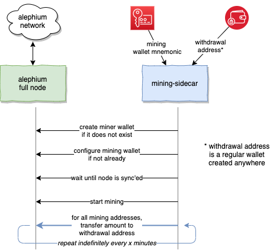

Alephium Mining Sidecar
====

This project is a sidecar for Alephium full nodes, providing some convenience features
when enabling mining:

1. Creates a mining wallet if none exists. 
   It can also restore the wallet if mnemonics are provided.
2. Configures the mining process to use the created wallet, 
   if one created or different from the one configured.
3. Starts the mining automatically when the node is in sync
4. Transfers the mining reward to another provided wallet/address
   on a fixed frequency (hourly, daily, ...). Note that the wallet
   can be created anywhere as long as it's a valid Alephium address

Sidecar means it needs to run alongside an Alephium full node,
and particularly have REST connectivity to it (default port 12973)



# Configuration

## Docker compose

Docker-compose is a good way of running the side, assuming the
[Alephium node is also running in docker](https://touille.io/posts/how-to-run-alephium-full-node/).

```
version: "3"
services:
  mining-sidecar:
    image: touilleio/alephium-mining-sidecar:v1
    restart: unless-stopped
    security_opt:
      - no-new-privileges:true
    environment:
      - LOG_LEVEL=debug
      # provided via .env file, miningWalletName=...
      - WALLET_NAME=$miningWalletName 
      # miningWalletPassword=... in .env file
      - WALLET_PASSWORD=$miningWalletPassword
      # miningTransferAddress=... in .env file
      - TRANSFER_ADDRESS=$miningTransferAddress
    labels:
      - org.label-schema.group=alephium
```

| Variable | Default | Description |
|----------|---------|-------------|
| `ALEPHIUM_ENDPOINT` | `http://alephium:12973` | REST URI of your Alephium node. Mind localhost in a docker container point to the docker container, not the host itself. |
| `WALLET_NAME` | `mining-sidecar-wallet-1` | Name of the miner wallet |
| `WALLET_PASSWORD` | `Default-Password-1234` | Password to unlock the miner wallet |
| `WALLET_MNEMONIC` | _optional_ | Mnemonic to restore (create) the wallet if it does not exist. Random mnemonic will be generated if not set |
| `WALLET_MNEMONIC_PASSPHRASE` | _optional_ | A passphrase associated with the mnemonic, if any |
| `TRANSFER_MIN_AMOUNT` | 5000000000000000000 (5 ALF) | Min amount to transfer at once. It also count as the amount reserved for the gas fee, i.e. if wallet contains 12 ALF, 5 a kept and only 7 are transferred |
| `TRANSFER_MAX_AMOUNT` | 50000000000000000000 (50 ALF) | Max amount to transfer at once. |
| `TRANSFER_ADDRESS` | _mandatory_ | Address to transfer the mining rewards to. If none provided, no transfer is performed. Double check you're sending the funds to the right address !! |
| `TRANSFER_FREQUENCY` | `15m` | Frequency at which funds are transferred |
| `PRINT_MNEMONIC` | `true` | If true and a wallet is created without pre-set mnemonic (`WALLET_MNEMONIC` option above), the randomly generate mnemonic is printed out. This is a sensitive information, use it with caution! |
| `IMMEDIATE_TRANSFER` | `false` | If set to true, a transfer is sent at the start of the container, without waiting for `TRANSFER_FREQUENCY` initial time |

## Docker

Replace `T123456789012345678901234567890123456789012345` below with your own wallet address!

```
docker run -it --rm --link alephium:alephium -e TRANSFER_ADDRESS=T123456789012345678901234567890123456789012345 touilleio/alephium-mining-sidecar:v1
```

As a reminder, running a Alephium full node looks like the following:

```
docker run -it --rm --name alephium -p 12973:12973 touilleio/alephium:v0.7.8
```
